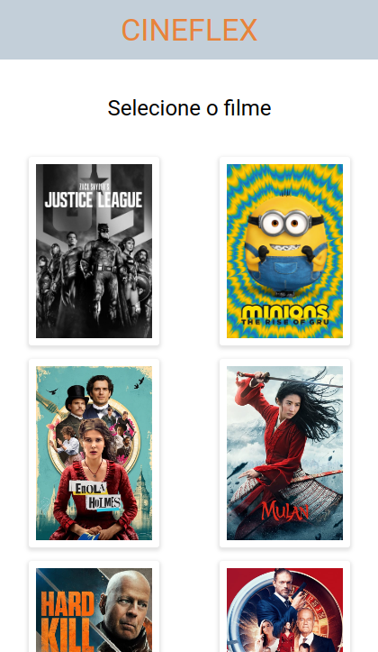

  <h1>CINEFLEX</h1>

 
  
- Front-end de um aplicativo web para cinema
   
- Tela exclusiva para mobile
   
- Conexão com a API utilizando axios para alimentação dos dados dos filmes em cartaz, sessões e lugares disponíveis.

# Funcionalidades
- Escolha qualquer flme em cartaz
- Várias opções de sessões em dias e horários diferentes
- Escolha os lugares disponíveis 
- Preencha os seus dados 
- Pronto! está reservado!

# Tecnologias 
- 
- 
- 
- 
- 
- 
- 
- 

# Preview

  
   
   
  
Clique na imagem para acessar a página

 
